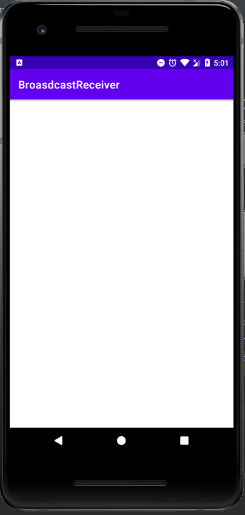
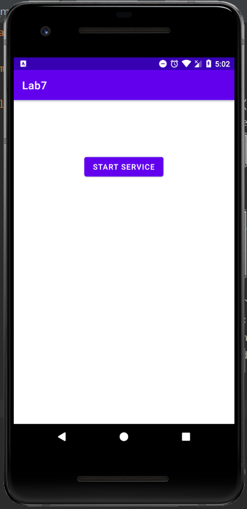
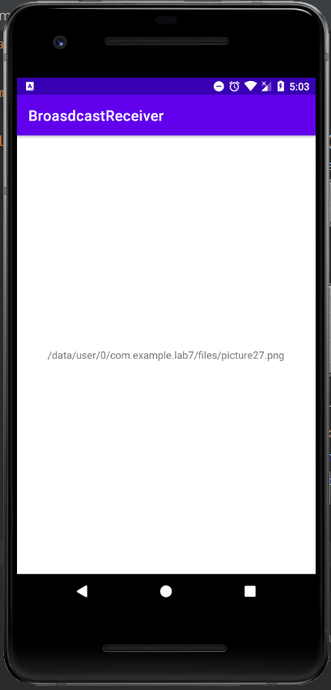

# Лабораторная работа №7. Сервисы и Broadcast Receivers.
## Цели
Получить практические навыки разработки сервисов (started и bound) и Broadcast Receivers.

## Программа работы
#### Задача 1. Started сервис для скачивания изображения
За основу для разрабатываемого сервиса была взята реализация скачивания картинки на корутинах. Из MainActivity по нажатию кнопки запускается сервис с интентом, содержащим url скачиваемой картинки. Внутри класса сервиса все основные действия выполняются в функции onStartCommand(). Здесь из intent  извлекается url и в корутине (как и в предыдущей лабораторной) производится скачивание. После этого картинка сохраняется во внутреннее хранилище с динамическим именем и выводом соответсвующих сообщений в лог. Так же внутри корутины в лог отправляется 2 сообщения: имя текущего потока, а также сообщение об успешном скачивании картинки. Кроме того после скачивания посылается широковещательное сообщение, содержащее путь к картинке.
```
class MainActivity : AppCompatActivity() {
    override fun onCreate(savedInstanceState: Bundle?) {
        super.onCreate(savedInstanceState)
        val binding = ActivityMainBinding.inflate(layoutInflater)
        setContentView(binding.root)

        binding.button.setOnClickListener {
            val intent = Intent(this, ImageDownloader::class.java).apply {
                putExtra("url", "https://wallbox.ru/wallpapers/main2" +
                        "/202046/16050262595faac1d3d9aec1.70131582.jpg")
            }

            startService(intent)
        }
    }
}

class ImageDownloader : Service() {
    private val scope = CoroutineScope(Dispatchers.IO)

    override fun onStartCommand(intent: Intent?, flags: Int, startId: Int): Int {
        val url = intent?.getStringExtra("url")
        var path: String? = null

        if (url != null) {
            scope.launch(Dispatchers.IO) {
                Log.d("ImageDownloader",
                    "ImageDownloader started in ${Thread.currentThread().name}")
                var picture: Bitmap? = null
                try {
                    val stream = URL(url).openStream()
                    picture = BitmapFactory.decodeStream(stream)
                } catch (e: Exception) {
                    e.message?.let { Log.e("Error", it) }
                    e.printStackTrace()
                }

                path = picture?.save(filesDir)
                sendBroadcast(Intent("Download complete"). apply {
                    putExtra("path", path) })

                Log.d("ImageDownloader",
                    "Successfully download in $path")
                stopSelf(startId)
            }
        } else {
            stopSelf(startId)
        }

        return START_NOT_STICKY
    }

    private fun Bitmap.save(folder: File): String {
        var i = 1
        while (true) {
            val f = File(filesDir, "picture${i}.png")
            if (!f.exists()) {
                break
            }
            i++
        }

        val file = "picture${i}.png"

        Log.d("ImageDownloader", "Starting to download picture${i}.png")

        openFileOutput(file, MODE_PRIVATE).use {
            compress(Bitmap.CompressFormat.PNG, 100, it)
        }

        return File(filesDir, file).absolutePath
    }

    override fun onDestroy() {
        scope.cancel()
    }

    override fun onBind(intent: Intent?): IBinder? = null
}
```


___

#### Задача 2. Broadcast Receiver
В качестве первого приложения было взято решение задачи №1. Второе приложение состоит из класса MainActivity в котором регистрируется объект класса, наследующего  BroadcastReceiver, в методе onReceive кторого из широковещательного сообщения извлекается путь к сохраненной картинке и выводится на экран. Код реализуемого приложения представлен ниже.

```
class MainActivity : AppCompatActivity() {
    override fun onCreate(savedInstanceState: Bundle?) {
        super.onCreate(savedInstanceState)
        setContentView(R.layout.activity_main)

        registerReceiver(
                MBroadcastReceiver(),
                IntentFilter("Download complete")
        )
    }

    inner class MBroadcastReceiver : BroadcastReceiver() {
        override fun onReceive(context: Context?, intent: Intent?) {
            val path = intent?.getStringExtra("path")
            findViewById<TextView>(R.id.textView).text = path
        }
    }
}
```

Далее приведены скриншоты совместной работы 2 приложений:





Изначально на экране приложения BroadcastReceiver ничего не отображается, а после нажатия кнопки Start Service в первом приложении на экране BroadcastReceiver'а появляется путь к скачанной картнике.

___

#### Задача 3. Bound Service для скачивания изображения
 Для того, чтобы сделать сервис не только started, но и bound, был переопределен его метод onBind, а именно: в методе onCreate основной активити вызывается метод bindService, устанавливающий соединение с сервисом. У активити и у сервиса реализованы свои Handler классы, первый из которых, получая отправленные ему сообщения, вытаскивает из них строку с путем к скачанной картинке и устанавливает ее в TextView на экране:
 ```
 class MActivityHandler(looper: Looper, private val binding: ActivityMainBinding) : Handler(looper) {
    override fun handleMessage(msg: Message) {
        if (msg.what != 321) {
            super.handleMessage(msg)
            return
        }

        binding.pathFromBoundService.text = msg.obj as String
    }
}
 ```
 
  Второй создает корутину, аналогичную той, что в методе onStartCommand, когда получает сообщение от мессенджера активити. По завершении скачивания с помощью механизма replyTo отправляется ответное сообщение с путем к скачанной картинке, которое обрабатывается в хендлере, описанном выше.
  ```
  class MServiceHandler(looper: Looper, private val downloader: ImageDownloader) : Handler(looper) {
    private val scope = CoroutineScope(Dispatchers.IO)

    override fun handleMessage(msg: Message) {
        if (msg.what != 123) {
            super.handleMessage(msg)
            return
        }
    
        val url = msg.obj as String
        var path: String?

        val replyTo = msg.replyTo

        scope.launch(Dispatchers.IO) {
            Log.d("ImageDownloader",
                    "ImageDownloader started in ${Thread.currentThread().name}")
            var picture: Bitmap? = null
            try {
                val stream = URL(url).openStream()
                picture = BitmapFactory.decodeStream(stream)
            } catch (e: Exception) {
                e.message?.let { Log.e("Error", it) }
                e.printStackTrace()
            }

            var i = 1
            while (true) {
                val f = File(downloader.filesDir, "picture${i}.png")
                if (!f.exists()) {
                    break
                }
                i++
            }

            val file = "picture${i}.png"

            Log.d("ImageDownloader", "Starting to download picture${i}.png")

            downloader.openFileOutput(file, Service.MODE_PRIVATE).use {
                picture?.compress(Bitmap.CompressFormat.PNG, 100, it)
            }

            path = File(downloader.filesDir, file).absolutePath

            Log.d("ImageDownloader",
                    "Successfully download in $path")

            replyTo.send(Message.obtain().apply {
                obj = path
                what = 321
            })
        }
    }
}
  ```
  
  Так же реализовн класс наследник класса ServiceConnection, в котором переопределены методы для подключения и отключения клиента от сервиса с соответсвующими действиями по созданию и удалению мессенджера на стороне активити.
 ```
 class MServiceConnection: ServiceConnection {
    var serviceMessenger: Messenger? = null

    override fun onServiceConnected(name: ComponentName?, service: IBinder?) {
        serviceMessenger = Messenger(service)
    }

    override fun onServiceDisconnected(name: ComponentName?) {
        serviceMessenger = null
    }

}
 ```
 
## Выводы:
В данной лабораторной работе:
   - Изучен процесс создания started и bound сервисов
   - Реализован BroadcastReceiver
   - Отработан процесс запуска сервиса, а так же подключения к нему и двустороннего взаимодействия путем использования мессенджеров на стороне клиента и сервиса
